# Resume Skill — 简历生成与美化

> 🌐 **中文** · [English](./README.md)

> 一个 Claude / Copilot **skill**,把"我需要一份好看的简历"变成一条稳定流程:所有素材先汇入一份**标准化结构化数据**,再套模板渲染。换模板只是换皮,内容不丢。


---

## 三条入口

| 用户说的话 | 流程 | 脚本 |
|---|---|---|
| "帮我美化简历" / 上传了 PDF/docx/txt | **A. 美化已有简历** | [`prompts/beautify.md`](prompts/beautify.md) |
| "这是我的 LinkedIn" / 贴 linkedin.com 链接 | **B. LinkedIn 导入** | [`prompts/linkedin-import.md`](prompts/linkedin-import.md) |
| "帮我从零做一份" / "咱们聊一聊" | **C. 对话式建简历** | [`prompts/interview.md`](prompts/interview.md) |

三条入口最终都把数据汇入 [`schema/resume-data.md`](schema/resume-data.md),再套模板渲染。

## 11 套模板

| 预览 | 模板 | 适合 |
|:---:|---|---|
| 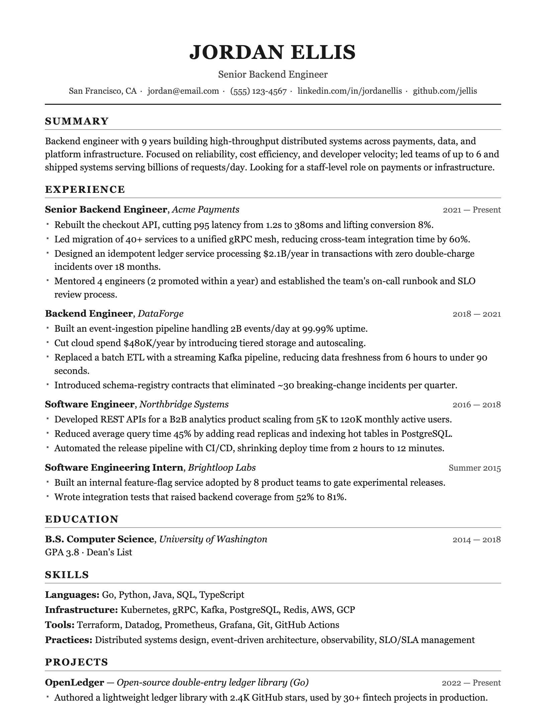 | **Classic / ATS**<br>[`classic-ats.html`](templates/classic-ats.html) | 单栏无花哨,机器可解析,大公司海投最稳 |
| 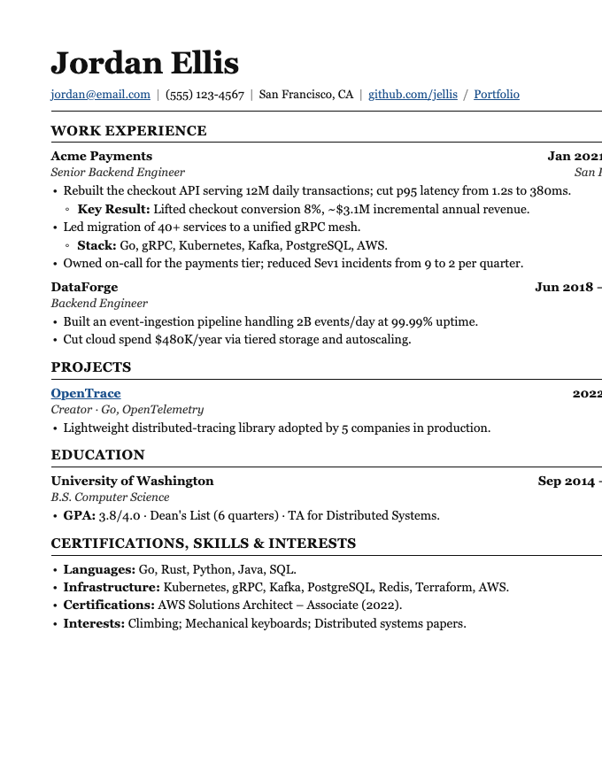 | **Ledger 学术工程**<br>[`ledger.html`](templates/ledger.html) | LaTeX 风衬线,两端对齐,嵌套子弹,软件/数据/工程岗 |
| 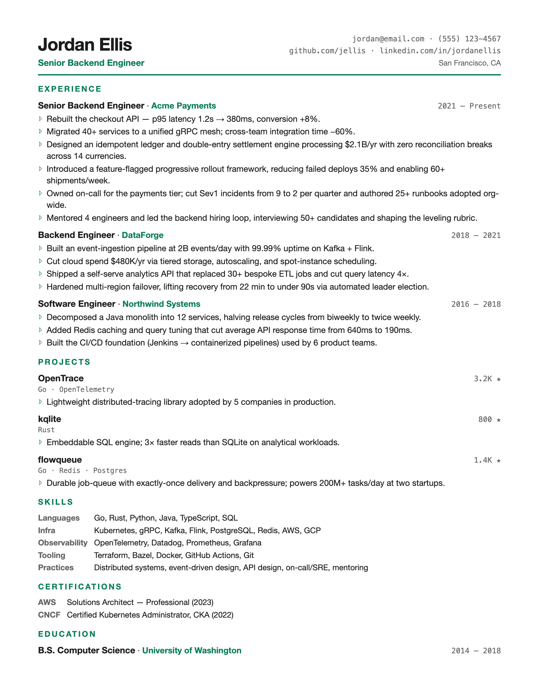 | **Tech 紧凑**<br>[`tech-compact.html`](templates/tech-compact.html) | 高信息密度+等宽点缀,多项目塞一页 |
| 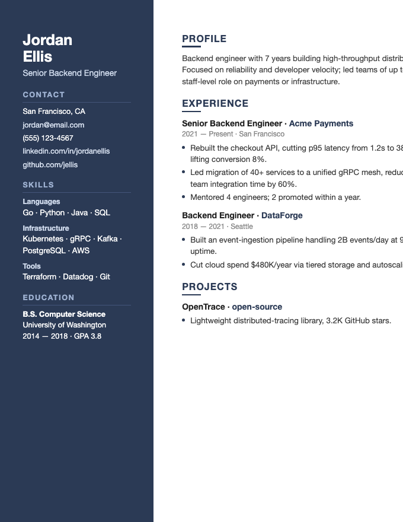 | **Modern 侧栏**<br>[`modern-sidebar.html`](templates/modern-sidebar.html) | 双栏+深色侧边栏,现代感强 |
| 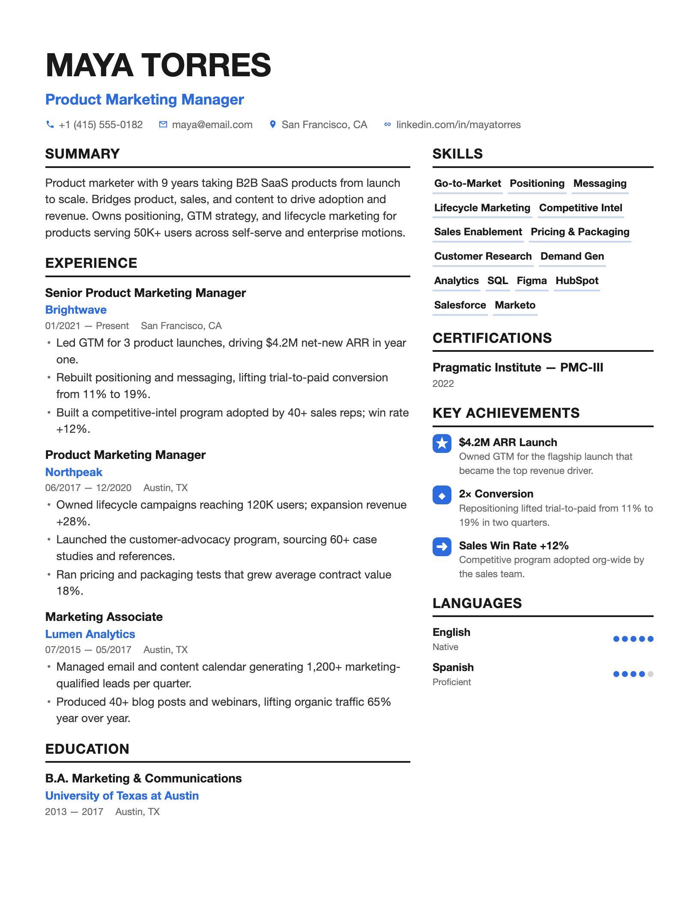 | **Pillar 信息卡**<br>[`pillar.html`](templates/pillar.html) | Enhancv 风,蓝点缀+技能胶囊+图标成就,产品/市场/PM |
| 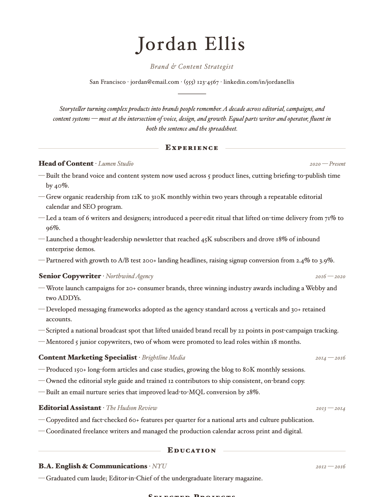 | **Elegant 衬线**<br>[`elegant-serif.html`](templates/elegant-serif.html) | 衬线居中编辑风,设计/咨询/市场 |
| 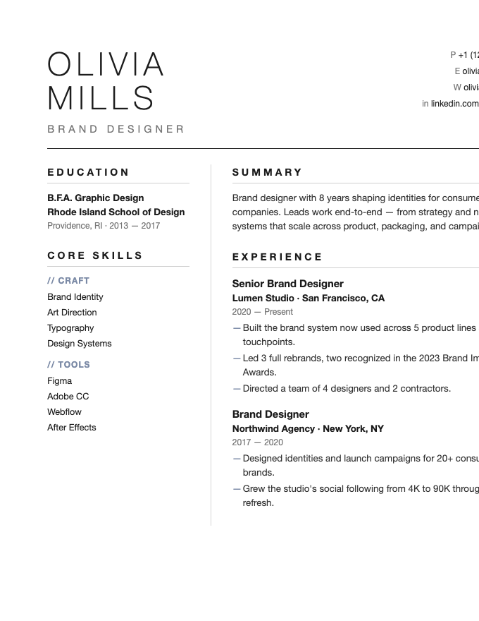 | **Atelier 极简**<br>[`atelier.html`](templates/atelier.html) | 大量留白+细字大写名+竖线分栏,设计/创意/审美岗 |
| 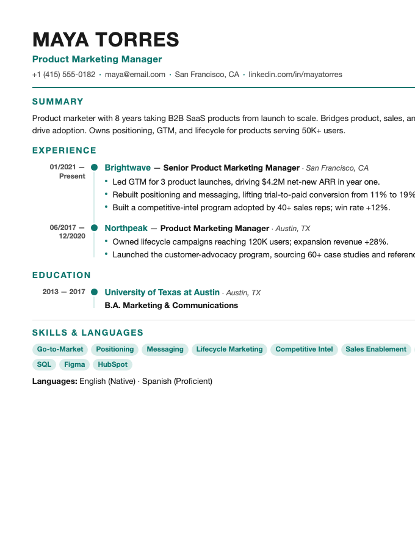 | **Timeline 时间轴**<br>[`timeline.html`](templates/timeline.html) | 左侧竖向时间轴脊柱,一眼看出职业成长轨迹 |
| 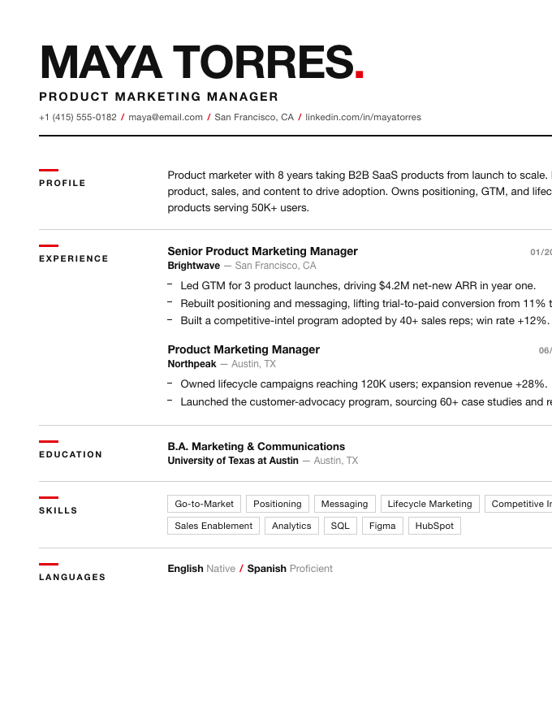 | **Swiss 栅格**<br>[`swiss.html`](templates/swiss.html) | 瑞士栅格,粗体 Helvetica + 红点缀,设计/品牌/创意 |
| 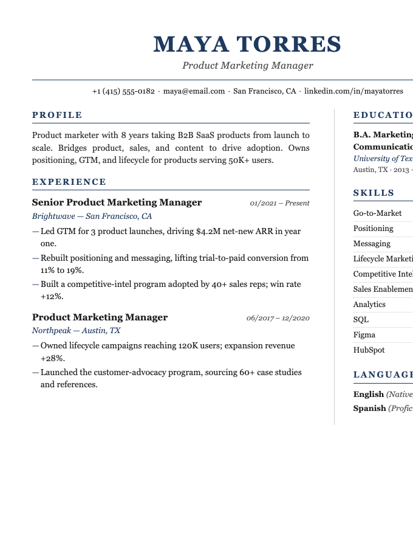 | **Executive 高管**<br>[`executive.html`](templates/executive.html) | 藏青衬线,稳重有分量,金融/咨询/高管/资深领导 |
| 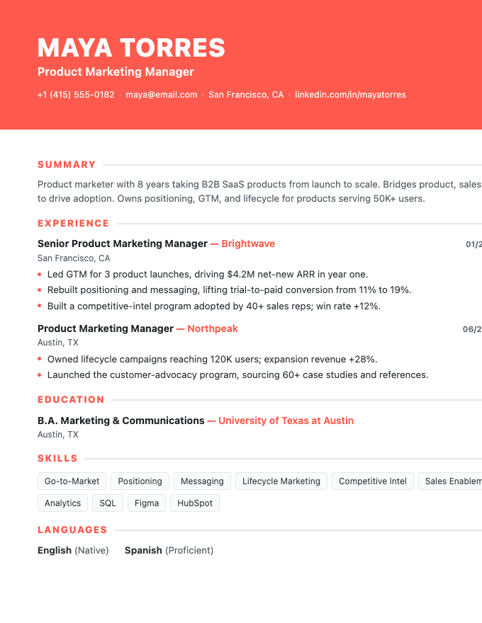 | **Color-block 色块头**<br>[`colorblock.html`](templates/colorblock.html) | 顶部整宽珊瑚色块,现代大胆,互联网/营销/年轻求职者 |

**选模板提示**:海投/过机器筛 → Classic/ATS 或 Ledger;人直接看/内推/作品集向 → 其余几套更出彩。

## 三条第一原则

1. **绝不杜撰。** 所有经历、职责、数字必须来自用户真实提供的内容。可以引导、追问、把弱 bullet 改强,但绝不编造公司、职位、成果或量化数字。任何数字都向用户求证,不确定就标 `[待确认]`。
2. **一次只问一个问题。** 对话式建简历是访谈不是问卷。
3. **先结构化,再渲染。** 不管入口是哪条,都先把内容整理成 `schema/resume-data.md` 定义的字段,确认无误后才套模板出 HTML。

## 用法

把整个 `resume-skill/` 目录放到 skills 文件夹(如 `~/.claude/skills/resume-skill/`),然后直接说"帮我美化这份简历"(附 PDF)、"我没有简历,咱们聊聊帮我做一份"、"这是我的 LinkedIn,帮我建一份"。Claude 读 `SKILL.md` 走对应流程。

**输出**:自包含的单文件 HTML(`<姓名>-resume-<模板>.html`),浏览器打开 → `Cmd+P` → 另存为 PDF(边距 None/Default、勾选背景图形)。

## 目录结构
```
resume-skill/
├── SKILL.md                       # 流程总入口(必读)
├── schema/resume-data.md          # 标准结构化字段(所有入口的中转格式)
├── prompts/
│   ├── beautify.md                # 入口 A:美化已有简历
│   ├── linkedin-import.md         # 入口 B:LinkedIn 导入与降级方案
│   └── interview.md               # 入口 C:对话式采集脚本
├── guides/writing-tips.md         # bullet 写法、量化、ATS 关键词、常见错误
└── templates/                     # 11 套打印优化 HTML 模板
```

## 配套 skill
- [job-description-skill](https://github.com/yanliudesign/job-description-skill) — JD 解码 + Offer 策略 OS
- [Behavior-question-skill](https://github.com/yanliudesign/Behavior-question-skill) — 行为面试 / 职业故事 OS

## License
MIT
